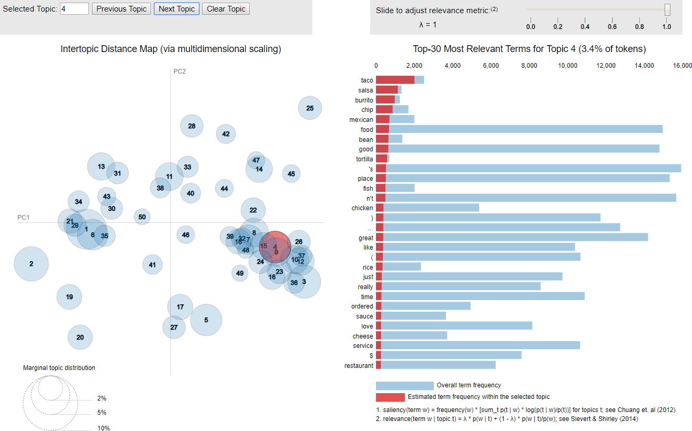
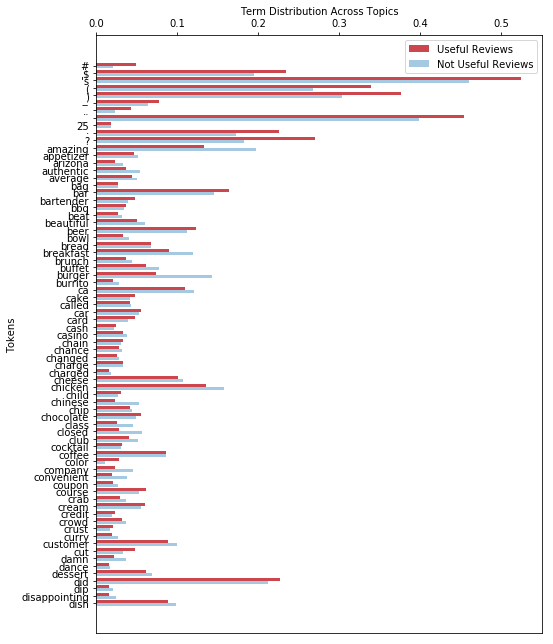
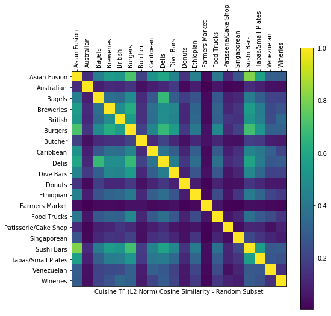
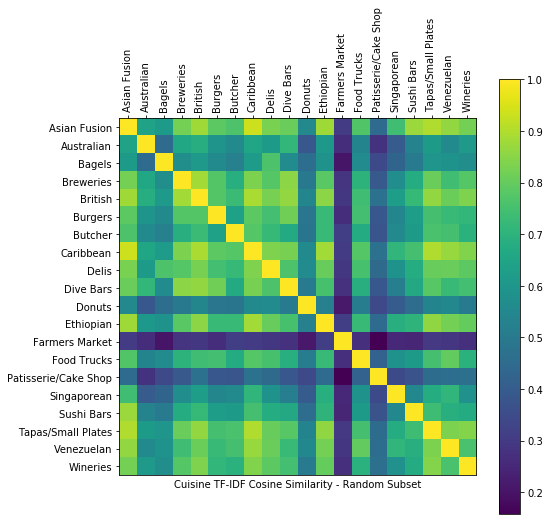
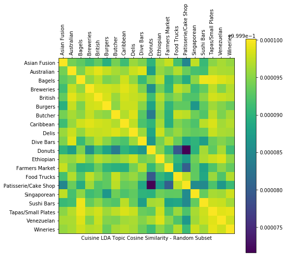
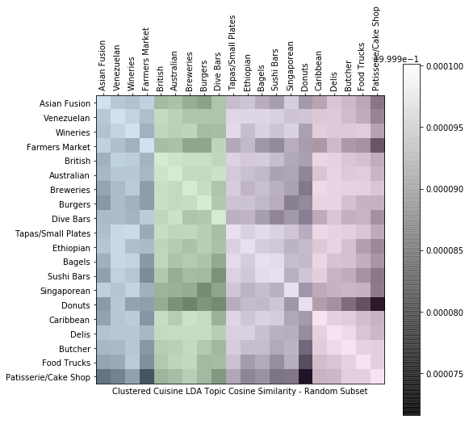

# Mining-Yelp-text-reviews-for-restaurants
1) Initial Topic Investigation
* Cleaned Yelp Review data
* Calculated TF-IDF (after lemmatizing and stemming) on a 30% random sample
* Found topics using Latent Dirichlet Allocation
  * Most topics suggest a type of business such as a hotel or Mexican restaurant
  * Example using [pyLDAvis package](https://github.com/bmabey/pyLDAvis):<br>
* Split reviews into useful (>0 votes for useful) versus not useful (0 votes for useful) score to compare topics  
  * The not-useful reviews included both low-utility *and semantic* words as a higher proportion of their topic distributions
  * Visual:<br>
    
2) Cuisine Map
* Compared cuisine similarity by analyzing restaurant review text
* Initially calculated cosine similarity for TF
  * Many cuisines appear strongly dissimilar using this simple comparison (see dark bands below)
  * Visual:<br>
* Improved comparison by applying IDF before calculating cosine similarity
  * "Document" in IDF means a virtual document concatenating all reviews for a cuisine
  * Visual:<br>
* Attempted to improve comparison by mining topics using LDA
  * Unfortunately, this excessively "flattened" the cosine similarity with a peak value of 0.0001
  * Visual:<br>
* Found groups of similar cuisines by applying K-Means clustering
  * Clustering improves the comparison but still exhibits odd results like grouping "Asian Fusion", "Venezuelan", "Wineries", and "Farmers Market"
  * Visual:<br>
    
3) Mine Popular Dishes
* Manually cleaned the provided list of Mexican dishes
  * Found an excessive proportion of non-dishes
  * Suggested initial phrase mining yielded poor results
* Added dishes from [Wikipedia page for "List of Mexican dishes"](https://en.wikipedia.org/wiki/List_of_Mexican_dishes)
  * Referred to as "distant expert" labeling by the [AutoPhrase](https://github.com/shangjingbo1226/AutoPhrase)'s authors \[1\]\[2\]
  * Increased the initial list of 25 dishes to 242
* Attempted to find more dishes with [AutoPhrase](https://github.com/shangjingbo1226/AutoPhrase)
  * Fed known dish labels into the mining algorithm to improve results...
  * ...but found them only marginally useful with the most frequent phrases overwhelmed by non-dishes:
    
4) Rank Popular Dishes
* Initially ranked Mexican dishes by review appearances
  * "Appearance" only counts the first use of cuisine in a review; multiple uses in a single review do not count to minimize variance due to reviewer sentiment, writing style, etc.
  * Visual:<br>
* Adjusted rank by review stars
  * Point scale adjusted from [1, 5] to [-1, 1] such that low-scoring reviews reduce a dish's popularity
  * Visual:<br>
    
5) Recommend Restaurants by Dish
* Initially ranked restaurants by calculating the proportion of dish appearances in each restaurant's reviews
  * This simple approach leads to restaurants with few reviews can achieve 100% review appearances for a single dish
  * Visual:<br>
* Adjusted rank by review Stars
  * As in ranking dishes, point scale adjusted from [1, 5] to [-1, 1] such that low scoring reviews reduce a dish's popularity for a specific restaurant
  * Visual:<br>
* Visualized top ranking restaurants and dishes:<br>
  
6) Predict Hygiene Inspection Results
* Employed multiple text representations and predictive models to determine whether a restaurant would fail its next hygiene inspection
  * Text representations included:
    * Unigram probability (*not* TF-IDF due to concatenation of all reviews for each restaurant)
    * Recursive Feature Reduction ([`RFE` on SciKit Learn](http://scikit-learn.org/stable/modules/generated/sklearn.feature_selection.RFE.html#sklearn.feature_selection.RFE.get_support)) of unigrams
    * Latent Symantic Analysis ([`TruncatedSVD` in SciKit Learn](http://scikit-learn.org/stable/modules/generated/sklearn.decomposition.TruncatedSVD.html#sklearn.decomposition.TruncatedSVD)) of unigrams
    * Frequent phrases (up to trigram) with and without LSA
  * Predictive models included:
    * Logistic Regression
    * K-Nearest Neighbor
    * Random Forest
    * Naïve Bayes
* Interestingly, LSA of unigrams fed into logistic regression performed better than all other models:

```
Model 03: Latent Symantic Analysis of Unigram Frequency Before Logistic Regression
-----
F-1 Score: 0.674419
True Negatives: 50
True Positives: 58
False Negatives: 28
False Positives: 28
```
